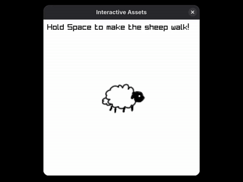

# FGCT4015-Interactive-Assets
The sheep moves. Hold Space to make the sheep walk! Listen to the sheep patter along with the chill song in the background.

[Click Here to watch the video with sound](./assets/interactiveassets.mp4)

## Texture and Audio Loading
Textures and sounds are unloaded at the end of the main() function, before the audio device and window are closed.

## Building on Linux
In the root of the directory, make sure the file is executable using `chmod +x ./build.sh`, then run `./build.sh`.